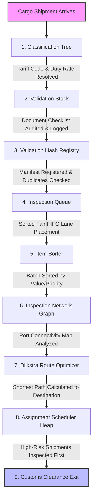

# 🏢 CustomOS

### *Smart Customs Clearance & Inspection Management System*

[](https://en.cppreference.com/w/cpp/17)
[](#)
[](#)
[](https://opensource.org/licenses/MIT)

CustomOS is an educational yet highly realistic customs management simulation platform designed to showcase the practical applications of core **Data Structures and Algorithms (DSA)** in global logistics and supply chain security. By modeling the complete journey of imported/exported cargo—from hierarchical classification and historical document audits to queue inspection, sorting, port routing, and priority scheduling—CustomOS demonstrates how algorithmic solutions solve complex real-world trade problems.

---

## 📌 Table of Contents

- [🏢 CustomOS](#-customos)
    - [*Smart Customs Clearance \& Inspection Management System*](#smart-customs-clearance--inspection-management-system)
  - [📌 Table of Contents](#-table-of-contents)
  - [📖 Project Overview](#-project-overview)
  - [🌳 Core DSA Modules](#-core-dsa-modules)
    - [🌳 1. Classification Tree (General Tree)](#-1-classification-tree-general-tree)
    - [📚 2. Validation Record (Stack)](#-2-validation-record-stack)
    - [🚚 3. Inspection Pipeline (Queue)](#-3-inspection-pipeline-queue)
    - [⚡ 4. Validation Hash (Hash Table)](#-4-validation-hash-hash-table)
    - [📊 5. Item Sorter (Sorting Algorithms)](#-5-item-sorter-sorting-algorithms)
    - [🌐 6. Inspection Network (Graph)](#-6-inspection-network-graph)
    - [🛣️ 7. Clearance Route Optimizer (Dijkstra's Algorithm)](#️-7-clearance-route-optimizer-dijkstras-algorithm)
    - [⏫ 8. Assignment Scheduler (Priority Queue / Max-Heap)](#-8-assignment-scheduler-priority-queue--max-heap)
  - [🔄 Complete Workflow](#-complete-workflow)
  - [🏗️ System Architecture](#️-system-architecture)
  - [📁 Project Structure](#-project-structure)
  - [📈 Performance Analysis](#-performance-analysis)
  - [🌍 Real-World Applications](#-real-world-applications)
  - [🎓 Learning Objectives](#-learning-objectives)
  - [🚀 Future Enhancements](#-future-enhancements)
  - [🛠️ Technology Stack](#️-technology-stack)
  - [📄 License](#-license)

---

## 📖 Project Overview

Global trade relies on the fast and secure processing of millions of shipping containers daily. Customs agencies face a dual challenge: facilitating legitimate commerce to avoid port congestion while inspecting high-risk cargo to prevent illicit trade. 

**CustomOS** solves this by simulating a digital customs clearance infrastructure. Unlike simple text-based data structure demonstrations, CustomOS unifies multiple fundamental and advanced DSA concepts into a single, continuous workflow. A shipment is not just a record in a database; it is a node in a general classification tree, an item in an audit stack, a job in an inspection queue, a hashed index in a registry, an element in a sorting engine, a vertex in an international transit graph, a path target in a Dijkstra route finder, and a prioritized leaf in a scheduling max-heap.

---

## 🌳 Core DSA Modules

### 🌳 1. Classification Tree (General Tree)

#### 📋 Purpose
The classification tree represents the hierarchical **Harmonized System (HS) Codes** or tariff categories used globally to categorize imported goods.

```text
Products (Root)
├── Electronics
│   ├── Laptop
│   ├── Mobile
│   └── Tablet
├── Food
│   └── Perishables
└── Clothing
    ├── Activewear
    └── Footwear
```

#### ✨ Features
*   **Hierarchical Classification**: Models parent-child classification codes dynamically.
*   **Category Operations**: Dynamic insertion, deletion, and searching of tariff groups.
*   **Tariff Lookup**: Returns the duty rate associated with specific commodity subcategories.
*   **Subtree Traversals**: Traverses the categories to list all classifications.

#### 💡 Design Rationale
*   **Why a General Tree over Arrays or Linked Lists?**
    Tariff codes are naturally hierarchical (e.g., *Electronics* is a parent of *Laptops*, which is a parent of *Gaming Laptops*). Representing this structure in an Array or Linked List would result in flat structures that lose relational metadata. Searching or grouping subcategories would require an $O(N)$ linear scan. A Tree allows representation of nested structures, enables rapid category-specific lookups, and supports modular sub-hierarchy rendering in logarithmic time.

#### 📊 Complexity Analysis
*   **Insertion**: $O(K)$ where $K$ is the number of children at the parent node.
*   **Search**: $O(D \cdot K)$ where $D$ is the tree depth and $K$ is the average branching factor.
*   **Traversal**: $O(N)$ to visit all $N$ classification categories in the hierarchy.

---

### 📚 2. Validation Record (Stack)

#### 📋 Purpose
The validation stack acts as an auditable verification tracker. It maintains a secure history of document checks, security clearances, and official stamps.

#### ✨ Features
*   **Push Record**: Adds a new validation event (e.g., "Invoice Verified", "Health Permit Signed").
*   **Pop Record**: Reverts the most recent verification step if a processing error is detected.
*   **Audit Undo**: Simulates rolling back states in the reverse order of validation.

#### 💡 Design Rationale
*   **Why a Stack for Audit Tracking?**
    Customs audits require strict chronological backtracking. If a shipment's validation fails at stage 4, the officer must reverse validations step-by-step starting from stage 4 down to stage 3, then stage 2. This strict **Last-In, First-Out (LIFO)** behavior is natively modeled by a Stack. An array or list would allow illegal out-of-order alterations to the audit log, violating international trade compliance rules.

#### 📊 Complexity Analysis
*   **Push**: $O(1)$ constant time.
*   **Pop**: $O(1)$ constant time.
*   **Peek (Latest State)**: $O(1)$ constant time.

---

### 🚚 3. Inspection Pipeline (Queue)

#### 📋 Purpose
The inspection pipeline models physical inspection lanes at ports where shipments wait in order of arrival for scanning and physical unpacking.

#### ✨ Features
*   **Shipment Enqueue**: Appends newly arrived containers to the back of the queue.
*   **Shipment Dequeue**: Dispatches the container at the front of the queue to active inspection.
*   **Queue Fair Processing**: Ensures fairness by handling shipments chronologically.

#### 💡 Design Rationale
*   **Why a Queue over a Stack?**
    Logistics lanes must maintain fairness. The first container that arrives at a port lane must be the first one inspected to prevent infinite delays (starvation). This **First-In, First-Out (FIFO)** behavior ensures predictable transit times. Using a Stack would result in the last-arrived container being inspected first, leaving earlier containers stranded at the bottom of the stack indefinitely.

#### 📊 Complexity Analysis
*   **Enqueue**: $O(1)$ constant time.
*   **Dequeue**: $O(1)$ constant time.
*   **Peek Front**: $O(1)$ constant time.

---

### ⚡ 4. Validation Hash (Hash Table)

#### 📋 Purpose
The validation hash functions as a high-speed central lookup registry, storing active shipment manifests and their validation statuses for instant verification by customs officers at any border gate.

#### ✨ Features
*   **O(1) Shipment Lookup**: Instant retrieval of compliance data by Shipment ID.
*   **Duplicate Detection**: Instantly flags if a duplicate shipment ID tries to register.
*   **Collision Resolution**: Implements chaining or open addressing to handle hash collisions.

#### 💡 Design Rationale
*   **Why a Hash Table over linear search?**
    Ports handle hundreds of thousands of shipments a day. Performing an $O(N)$ linear search through a database or linked list to verify a container's manifest at a gate would cause miles-long traffic jams. A Hash Table provides an average lookup time of $O(1)$ by mapping shipment IDs directly to memory indices, bypassing the need to search sequentially.

#### 📊 Complexity Analysis
*   **Insertion**: $O(1)$ average, $O(N)$ worst-case (in case of severe collisions).
*   **Search/Lookup**: $O(1)$ average, $O(N)$ worst-case.
*   **Collision Handling**: Handled via linked chaining to maintain predictability.

---

### 📊 5. Item Sorter (Sorting Algorithms)

#### 📋 Purpose
The sorting engine organizes shipments based on dynamic operational parameters such as duty amount, shipment value, arrival time, or priority score.

#### ✨ Features
*   **Multi-Criteria Sort**: Sorts by value, duty, or chronological arrival.
*   **Multiple Algorithm Implementations**:
    1.  **Bubble Sort**: Educational demonstration of swapping.
    2.  **Selection Sort**: Minimizes physical write operations.
    3.  **Insertion Sort**: Highly efficient for nearly-sorted datasets.
    4.  **Merge Sort**: Guarantees stable $O(N \log N)$ sorting.
    5.  **Quick Sort**: High-performance in-place sorting.

#### 📊 Algorithm Comparison Table
| Algorithm | Best Time | Average Time | Worst Time | Space Complexity | Stable? | In-Place? |
| :--- | :---: | :---: | :---: | :---: | :---: | :---: |
| **Bubble Sort** | $O(N)$ | $O(N^2)$ | $O(N^2)$ | $O(1)$ | Yes | Yes |
| **Selection Sort** | $O(N^2)$ | $O(N^2)$ | $O(N^2)$ | $O(1)$ | No | Yes |
| **Insertion Sort** | $O(N)$ | $O(N^2)$ | $O(N^2)$ | $O(1)$ | Yes | Yes |
| **Merge Sort** | $O(N \log N)$ | $O(N \log N)$ | $O(N \log N)$ | $O(N)$ | Yes | No |
| **Quick Sort** | $O(N \log N)$ | $O(N \log N)$ | $O(N^2)$ | $O(\log N)$ | No | Yes |

---

### 🌐 6. Inspection Network (Graph)

#### 📋 Purpose
The inspection network models global shipping ports and physical shipping routes connecting key maritime hubs: **Mumbai Port**, **Dubai Port**, **Singapore Port**, **Rotterdam Port**, and **Hamburg Port**.

```text
       [Rotterdam Port] -------- (15) -------- [Hamburg Port]
          /          \                            /
        (25)         (12)                       (20)
        /              \                         /
[Mumbai Port] ------- (18) ------- [Singapore Port]
        \                                       /
        (10)                                  (30)
          \                                   /
           \----------- [Dubai Port] --------/
```

#### ✨ Features
*   **Node Representation**: Hub ports (e.g. `Mumbai_Port`, `Dubai_Port`, `Singapore_Port`, `Rotterdam_Port`, `Hamburg_Port`).
*   **Edge Weights**: Shipping costs, delays, or physical distance between ports.
*   **Breadth-First Search (BFS)**: Finds paths with the fewest transit transfers.
*   **Depth-First Search (DFS)**: Exhaustively checks route connectivity and reachability.

#### 💡 Design Rationale
*   **Why a Graph?**
    Global trade routes are not linear. They form a complex network of multi-directional pathways, hubs, and detours. A Graph is the only natural data structure capable of modeling these relationships, allowing the system to represent ports as vertices (nodes) and trade routes as weighted edges.

#### 📊 Complexity Analysis
*   **BFS / DFS**: $O(V + E)$ where $V$ is vertices (ports) and $E$ is edges (shipping lanes).
*   **Space**: $O(V^2)$ (Adjacency Matrix) or $O(V + E)$ (Adjacency List).

---

### 🛣️ 7. Clearance Route Optimizer (Dijkstra's Algorithm)

#### 📋 Purpose
Calculates the absolute fastest or lowest-cost shipping route between two ports in the inspection network, bypassing congested ports or high-risk waterways.

#### ✨ Features
*   **Optimal Path Calculation**: Finds the single-source shortest path.
*   **Dynamic Weight Adjustments**: Incorporates toll rates, weather delays, and fuel costs.
*   **Step-by-Step Navigation**: Outputs the precise sequence of intermediate ports.

#### 💡 Design Rationale
*   **Why Dijkstra's Algorithm?**
    Greedy algorithms like BFS fail to find the optimal path when edges have varying weights (e.g., shipping from Mumbai to Hamburg is faster via Suez/Rotterdam than traveling around Africa, even though both have intermediate stops). Dijkstra's algorithm uses a priority queue to systematically evaluate paths, guaranteeing the mathematically shortest route in $O(E \log V)$ time.

#### 📊 Complexity Analysis
*   **Time Complexity**: $O((V + E) \log V)$ using a binary min-heap implementation.
*   **Space Complexity**: $O(V)$ to maintain parent pointers and distance arrays.

---

### ⏫ 8. Assignment Scheduler (Priority Queue / Max-Heap)

#### 📋 Purpose
The assignment scheduler manages high-risk inspection tasks. Instead of inspecting items in order of arrival, it schedules them based on computed risk factors.

```text
           [Risk: 95] (Max Heap Root)
           /        \
     [Risk: 80]    [Risk: 75]
     /      \
[Risk: 45] [Risk: 60]
```

#### 🛡️ Priority Factors
*   **Risk Score**: Calculated based on the origin country, commodity type, and importer flag.
*   **Value of Goods**: Higher value goods are prioritized to avoid port holding fee penalties.
*   **Compliance History**: Importers with past violations are flagged with higher risk weights.

#### ✨ Features
*   **Insert Shipment**: Pushes a new shipment into the heap and bubble-ups to maintain heap property.
*   **Extract Highest Priority**: Retrieves and removes the shipment with the highest risk score.
*   **Dynamic Reprioritization**: Adjusts a shipment's risk dynamically if new intelligence arrives.

#### 💡 Design Rationale
*   **Why a Binary Heap?**
    Using a sorted array for priority scheduling requires $O(N)$ insertion time. An unsorted array requires $O(N)$ lookup to find the highest-risk item. A Binary Heap (Max-Heap) balances both operations, offering $O(\log N)$ insertion and $O(\log N)$ extraction. This ensures the scheduler remains ultra-responsive even during heavy port traffic peaks.

#### 📊 Complexity Analysis
*   **Insert**: $O(\log N)$ log time.
*   **Extract Max (Get highest risk)**: $O(\log N)$ log time.
*   **Get Max (Peek)**: $O(1)$ constant time.

---

## 🔄 Complete Workflow

When a cargo shipment is processed by CustomOS, it flows through a sequential processing pipeline. Each step is powered by a specific data structure:



### Detailed Pipeline Description
1.  **Arrival & Classification (Tree)**: The shipment is assigned an HS code. The system searches the **Classification Tree** to verify the category and retrieve the duty rate.
2.  **Audit Trail Logging (Stack)**: The document verification history (invoice check, dangerous goods declaration) is pushed onto the **Validation Stack** for secure rollback support.
3.  **Unique Registry Check (Hash Table)**: The manifest is stored in the **Validation Hash**. If the shipment ID is already present, it is flagged as a duplicate/fraudulent shipment and rejected.
4.  **Laning (Queue)**: Validated shipments enter the **Inspection Queue** waiting for a customs officer. This ensures fair, first-come-first-served handling.
5.  **Batch Analysis (Sorter)**: The manager uses the **Item Sorter** to sort containers by Duty Fee or Cargo Value to analyze backlogs.
6.  **Transit Planning (Graph)**: The shipment's origin and destination are mapped on the **Inspection Network Graph** showing current port nodes.
7.  **Route Calculation (Dijkstra)**: The system computes the optimal route (e.g., from `Singapore_Port` to `Rotterdam_Port` via intermediate hubs) using **Dijkstra's Algorithm**.
8.  **Priority Inspection (Heap)**: High-risk shipments are extracted from the **Assignment Scheduler Max-Heap** to go through intensive scanner bays before final release.
9.  **Clearance & Exit**: The shipment is marked cleared and leaves the port.

---

## 🏗️ System Architecture

CustomOS uses a modular, decoupled architecture where each DSA component operates as an independent backend service coordinated by the main engine.

```text
                                  +-----------------------+
                                  |      User Interface   |
                                  |     (CLI Dashboard)   |
                                  +-----------+-----------+
                                              |
                                              v
                                  +-----------+-----------+
                                  |    CustomOS Engine    |
                                  |   (Core Controller)   |
                                  +-----+-----+-----+-----+
                                        |     |     |
         +------------------------------+     |     +------------------------------+
         |                                    |                                    |
         v                                    v                                    v
+------------------+                 +------------------+                 +------------------+
|  Classification  |                 |    Validation    |                 |    Inspection    |
|      Module      |                 |      Module      |                 |      Module      |
| (Tariff Tree)    |                 | (Audit Stack /   |                 | (FIFO Queue /    |
+------------------+                 |  Hash Registry)  |                 |  Sorting Engine) |
                                     +------------------+                 +------------------+
                                              |
         +------------------------------------+------------------------------------+
         |                                                                         |
         v                                                                         v
+------------------+                                                      +------------------+
|  Routing Module  |                                                      |Scheduling Module |
| (Inspection Graph|                                                      |  (Priority Heap  |
|  / Dijkstra S.P) |                                                      |    Scheduler)    |
+------------------+                                                      +------------------+
         |                                                                         |
         +------------------------------------+------------------------------------+
                                              |
                                              v
                                  +-----------+-----------+
                                  |   Data & Reporting    |
                                  |  (CSV Manager / Logs) |
                                  +-----------------------+
```

---

## 📁 Project Structure

This directory structure highlights the modularity of the **CustomOS** design:

```text
CustomOS/
│
├── include/                     # Header Files (Class Definitions & API Contracts)
│   ├── tariffTree.h             # Hierarchical HS Code classification tree
│   ├── validationStack.h        # Document audit tracking stack
│   ├── inspectionQueue.h        # FIFO shipping container queue
│   ├── shipmentHash.h           # Manifest verification hash registry
│   ├── sorter.h                 # Bubble, Selection, Insertion, Merge, Quick sorts
│   ├── graph.h                  # Port networks structure (Adjacency Matrix/List)
│   ├── dijkstra.h               # Shortest route path planner
│   └── scheduler.h              # Risk-prioritization scheduling Max-Heap
│
├── src/                         # Implementation Files (Source Code)
│   ├── tariffTree.cpp           # Tree traversals and HS tariff logic
│   ├── validationStack.cpp      # Stack push, pop, and rollback operations
│   ├── inspectionQueue.cpp      # Enqueue and dequeue processing logic
│   ├── shipmentHash.cpp         # Chaining-based hash map operations
│   ├── sorter.cpp               # Sorter array partition and swapping code
│   ├── graph.cpp                # Graph BFS/DFS search algorithms
│   ├── dijkstra.cpp             # Dijkstra's shortest path computations
│   └── scheduler.cpp            # Max-Heap heapify-up and heapify-down algorithms
│
├── docs/                        # Project Documentation
│   ├── architecture.md          # Architectural decisions & system designs
│   ├── algorithms.md            # Deep-dive theoretical algorithm analysis
│   └── screenshots/             # Interface captures and output logs
│
├── main.cpp                     # Application entry point & interactive menu
├── Makefile                     # Build automation script
└── README.md                    # Core project presentation
```

---

## 📈 Performance Analysis

Below is the runtime complexity breakdown of the core operations in CustomOS.

| Module | Data Structure | Key Operation | Time Complexity (Best) | Time Complexity (Average) | Time Complexity (Worst) | Space Complexity |
| :--- | :--- | :--- | :---: | :---: | :---: | :---: |
| **Classification** | General Tree | Category Search | $O(1)$ | $O(D \cdot K)$ | $O(N)$ | $O(N)$ |
| **Classification** | General Tree | Node Insertion | $O(1)$ | $O(K)$ | $O(K)$ | $O(1)$ |
| **Validation** | Stack | Push / Pop | $O(1)$ | $O(1)$ | $O(1)$ | $O(N)$ |
| **Verification** | Hash Table | Registry Lookup | $O(1)$ | $O(1)$ | $O(N)$ | $O(N)$ |
| **Verification** | Hash Table | Duplicate Check | $O(1)$ | $O(1)$ | $O(N)$ | $O(1)$ |
| **Inspection** | FIFO Queue | Enqueue / Dequeue | $O(1)$ | $O(1)$ | $O(1)$ | $O(N)$ |
| **Sorting Engine** | Array | Quick Sort | $O(N \log N)$ | $O(N \log N)$ | $O(N^2)$ | $O(\log N)$ |
| **Sorting Engine** | Array | Merge Sort | $O(N \log N)$ | $O(N \log N)$ | $O(N \log N)$ | $O(N)$ |
| **Network Graph** | Adjacency List | BFS/DFS Traversal | $O(V + E)$ | $O(V + E)$ | $O(V + E)$ | $O(V)$ |
| **Route Optimizer**| Graph | Dijkstra Path | $O(E \log V)$ | $O(E \log V)$ | $O(E \log V)$ | $O(V)$ |
| **Scheduler** | Binary Max-Heap| Risk Extraction | $O(1)$ | $O(\log N)$ | $O(\log N)$ | $O(N)$ |
| **Scheduler** | Binary Max-Heap| Insert Job | $O(1)$ | $O(\log N)$ | $O(\log N)$ | $O(1)$ |

---

## 🌍 Real-World Applications

Algorithms used in CustomOS model core processing concepts used by major systems:

*   **Customs Departments & Border Control**: Similar classification trees are used by systems like ASYCUDA (UNCTAD) to categorize tariff codes and automatically calculate duties.
*   **Airport Security & Checkpoint Flow**: Baggage scanning queues follow strict FIFO processing, combined with Heap priority scheduling to inspect flagged passengers or luggage.
*   **Logistics & Freight Forwarding**: Companies like DHL, FedEx, and Maersk use graph shortest-path algorithms to optimize shipping lanes, reducing fuel and transit times.
*   **Smart Seaports**: Automated port terminals use Priority Queues (Heaps) to determine crane loading sequences, prioritizing containers carrying perishable foods or medical supplies.
*   **Government Record Audits**: IRS and customs validation history rely on secure stacks and hash registries to verify transactions and prevent double-spending or duplicate claims.

---

## 🎓 Learning Objectives

CustomOS serves as an educational framework for mastering core software engineering concepts:

*   **Tree Structures**: Understanding hierarchical parent-child pointer associations and deep traversals.
*   **LIFO & FIFO Mechanics**: Mastering the practical behavior differences between stacks and queues.
*   **Hash Maps**: Implementing custom key-to-index mapping algorithms and collision chain handling.
*   **Sorting Algorithms**: Analyzing the trade-offs in sorting speed, stability, and memory overhead.
*   **Graph Traversals**: Implementing BFS for search expansion and DFS for connectivity.
*   **Greedy Optimization**: Writing pathfinding algorithms using priority structures.
*   **Binary Heaps**: Building complete complete-binary-tree array mapping logic (parent/child calculations).
*   **Big-O Notation**: Real-world evaluation of worst-case time complexities.
*   **System Design**: Developing highly modular C++ programs using separated headers, source files, and build pipelines.

---

## 🚀 Future Enhancements

*   **🖥️ GUI Dashboard**: Transition the CLI interface into a modern Qt-based or web-fronted desktop application.
*   **🗄️ Database Integration**: Replace CSV files with an SQLite/PostgreSQL layer for real-time transactions.
*   **🔒 User Authentication**: Role-based access control (RBAC) separating "Customs Inspectors" and "Shipping Agents".
*   **🚢 Multi-Port Simulation**: Scaled graph nodes reflecting hundreds of sea hubs and container terminals globally.
*   **🤖 AI Risk Prediction**: Machine learning modules to dynamically output risk scores for the Heap Scheduler.
*   **⛓️ Blockchain Audits**: Integrating ledger verification for the validation stack to create tamper-proof logs.
*   **🌐 REST API Endpoints**: Exposing C++ modules as high-speed microservices via HTTP/gRPC.

---

## 🛠️ Technology Stack

*   **Core Language**: C++ (C++17 Standard)
*   **Key Paradigms**: Object-Oriented Programming (OOP), Custom Memory Management, Generics, and File I/O.
*   **Tools**:
    *   **Compiler**: GCC / G++ (MinGW-w64 for Windows, Clang for macOS)
    *   **IDE**: Visual Studio Code (VS Code) / CLion
    *   **Build Automation**: GNU Make (Makefile)
    *   **Version Control**: Git & GitHub

---

## 📄 License

This project is licensed under the MIT License. See the [LICENSE](LICENSE) file for details.

---

<p align="center">
  <b>CustomOS</b><br>
  <i>Where Data Structures Meet Global Trade</i><br>
  Built with C++, Algorithms, and a passion for efficient customs operations.
</p>
